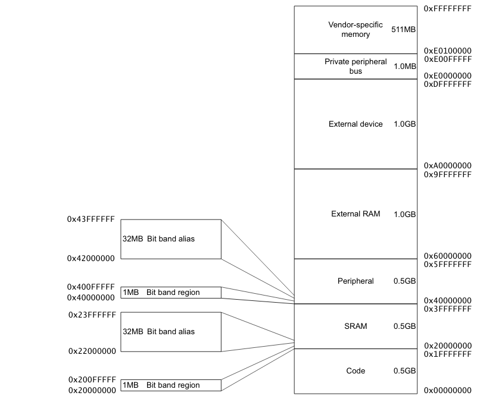

### Memory regions
nRF52840 FLASH memory region starts at address 0x00000000 and have size of 1M,
also its RAM region start at address 0x20000000 and have size of 256k.



FLASH is readable only and executable, but RAM is readable, writeable and
executable. So this will end up with the following memory region description in
linker script:

### Linker script

```
MEMORY {
    FLASH  (rx) : ORIGIN = 0x00000000,  LENGTH = 1M
    RAM   (rwx) : ORIGIN = 0x20000000,  LENGTH = 256K
}
```

Next we need to declare where code sections will be placed. This is done
by using SECTIONS directive. Most common section names are the following:
* **.text** - program code
* **.rodata** - read-only data
* **.data** - initialized global/static variables
* **.bss** - uninitialized global/static variables, which are zero
* **.preinit\_array** and **.init\_array** - contains arrays of pointers to
functions that will be called on initialization
* **.fini\_array** - contains array of pointers to functions that will be
called on destruction

Also we need section to hold ISR vector table and stack pointer value.
Let it be:
* **.stack** - stack pointer value
* **.isr\_vectors** - interrupt service routine vector table

```
/* Set program entry point */
ENTRY(RESET_Handler)

/* Set up memory type, origin, length and access type */
MEMORY {
    FLASH   (rx) : ORIGIN = 0x00000000, LENGTH = 1M
    RAM    (rwx) : ORIGIN = 0x20000000, LENGTH = 256K
}

SECTIONS {
    . = ORIGIN(FLASH);              /* set FW origin to 0x00000000 address   */
    .text ALIGN(4) : {              /* align to 32bit border due to ARM spec.*/
        KEEP(*(.stack))             /* stack section first                   */
        KEEP(*(.exception_vectors)) /* followed by exception                 */
        KEEP(*(.isr_vectors))       /* table and ISR.                        */
        *(.text)                    /* Then add text section                 */
        *(.text*)                   /* and finnaly,                          */
        KEEP(*(.rodata*))           /* put rodata at the end                 */
    } > FLASH                       /* Place this in flash                   */

    .preinit_array ALIGN(4) : {
        __preinit_array_start = .;
        KEEP(*(.preinit_array))
        KEEP(*(.preinit_array*))
        __preinit_array_end = .;
    } > FLASH

    .init_array ALIGN(4) : {
        __init_array_start = .;
        KEEP(*(.init_array))
        KEEP(*(.init_array*))
        __init_array_end = .;
    } > FLASH

    .fini_array ALIGN(4) : {
        __fini_array_start = .;
        KEEP(*(.fini_array))
        KEEP(*(.fini_array*))
        __fini_array_end = .;
    } > FLASH

    __etext = .;

    /* according to ARM should be aligned to 8-byte border */
    __stacktop = ALIGN (ORIGIN(RAM) + LENGTH(RAM), 8);
    __data_load = LOADADDR(.data);
    . = ORIGIN(RAM);

    .data ALIGN(4) : {
        __data_start = .;
        *(.data)
        *(.data*)
        . = ALIGN(4);
        __data_end = .;
    } > RAM AT > FLASH

    .bss ALIGN(4) (NOLOAD) : {
        __bss_start = .;
        *(.bss)
        *(.bss*)
        . = ALIGN(4);
        __bss_end = .;
        *(.noinit*)
    } > RAM

    . = ALIGN(4);
    __heap_start = .;
}
```


For **.vectors** `KEEP` kyeword is used to indicate the linker that this section
should not be throwed away in link process.
Section **.text**, **.rodata**, **.vectors** goes to FLASH memory and according to
ARMv7-M architecture, vector table is palced at the very beggining of FLASH memory
at address 0x00000000. And so sections **.data** and **.bss** goes to RAM memory.
But important note, due to harvard architecture and that RAM is volatile memory,
firstly we put these sections at FLASH and then copy to RAM at startup.\
We end up with:
```
ENTRY(main)

SECTIONS {
	.vectors : AT (0x00000000) {
		. = ALIGN(4);		/* align on 32-bit border */
		KEEP(*(.vectors))
		. = ALIGN(4);
	} > FLASH

	.text : {
		. = ALIGN(4);
		*(.text*)
		*(.rodata*)
		. = ALIGN(4);
		_etext = .;
	} > FLASH
	
	.data : AT (_etext) {		/* AT specifies LMA */
		. = ALIGN(4);
		_sdata = .;		/* Here we get VMA */
		*(.data*)
		. = ALIGN(4);
		_edata = .;
	} > RAM

	.bss : {
		. = ALIGN(4);
		_sbss = .;
		*(.bss*)
		. = ALIGN(4);
		_ebss = .;
	} > RAM
}
```

Stack top is defined as follows:
```
stackTop = ALIGN (ORIGIN(RAM) + LENGTH(RAM), 8);
```

---

> All images are taken from [NordicSemiconductors](https://infocenter.nordicsemi.com) site.
> Any copyright belongs to NordicSemiconductors©
